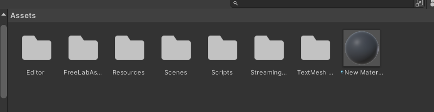
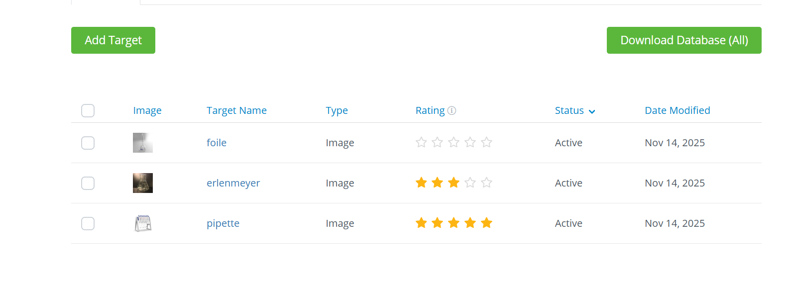
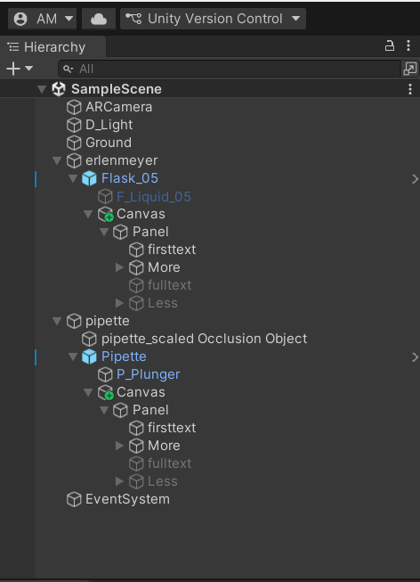

# TP Application Éducative en RA : Laboratoire Chimique

### Réalisé par

**Abla MARGHOUB**

---

## 1. Description du projet

Ce projet est une **application éducative en Réalité Augmentée (RA)** développée avec **Unity** et **Vuforia Engine**.
L’objectif est de permettre aux utilisateurs d’explorer **des instruments de laboratoire chimique** (pipette, Erlenmeyer, bécher, etc.) en 3D, avec :

* Animation de rotation des instruments
* Affichage de textes descriptifs courts et longs
* Interaction via un bouton “More” pour afficher plus d’informations
* Compatibilité avec **mobile AR** grâce à Vuforia

---

## 2. Fonctionnalités principales

| Fonctionnalité   | Description                                                                                                                  |
| ---------------- | ---------------------------------------------------------------------------------------------------------------------------- |
| Détection AR     | L’objet apparaît lorsqu’une **Image Target** est détectée par la caméra.                                                     |
| Rotation         | Chaque instrument peut **tourner sur son axe X** automatiquement.                                                            |
| Texte descriptif | Chaque instrument possède un **texte court** et un **texte complet**. Le bouton **More** permet d’afficher le texte complet. |
| Réutilisation    | Scripts réutilisables pour tous les instruments du laboratoire.                                                              |

---

## 3. Structure du projet Unity

---

## 4. Installation et configuration

1. **Unity et Vuforia**

   * Installer **Vuforia Engine** via le **Package Manager**.

2. **Importer les assets**

   * Télécharger et importer le **Free Laboratory Pack** depuis Unity Asset Store.

3. **Ajouter la caméra AR**

   * Supprimer la Main Camera.
   * Ajouter `GameObject → Vuforia Engine → AR Camera`.

4. **Ajouter un Image Target**

   * `GameObject → Vuforia Engine → Image Target`
   * Lier une **Device Database** et assigner une image cible.
   

5. **Placer les instruments**

   * Glisser les objets du pack (`Pipette`, `Erlenmeyer`, `Bécher`) dans l’Image Target.
   * Ajuster **position, rotation et scale**.

6. **Ajouter les scripts**

   * `RotateInstrument.cs` → pour la rotation sur l’axe X.
   * `ShowDescription.cs` → pour le texte court/long et le bouton “More”.

---

## 5. Paramétrage des textes descriptifs

Exemple pour l’Erlenmeyer :

* **shortDescription** :
  « Le flacon d’Erlenmeyer est un récipient en verre de forme conique avec un col étroit. »
* **fullDescription** :
  « Il est utilisé pour mélanger les solutions sans risque de renversement, réaliser des titrations, chauffer des liquides ou stocker des échantillons. »

> Les autres instruments suivent la même logique.

## Démonstation
<video controls src="labinstrument.mp4" title="Title"></video>

Le lien de projet:

https://drive.google.com/drive/folders12PM_TFqgDyEPvXoXYS7pUVACY-8PKB9q